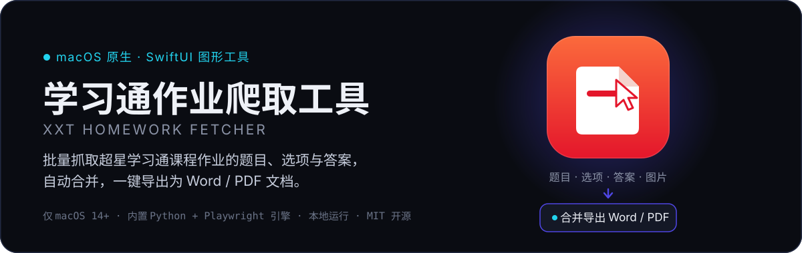
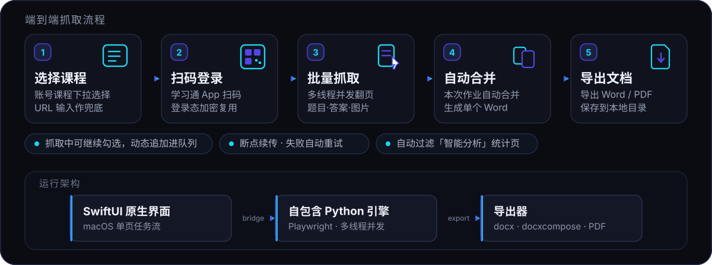

<p align="center">
  
</p>

<p align="center">
  <b>批量抓取超星学习通（Chaoxing）课程作业，一键导出合并 Word / PDF 的 macOS 原生工具。</b><br/>
  SwiftUI 图形界面 · 内置自包含 Python + Playwright 引擎 · 全程本地运行、不上传任何数据
</p>

> **⚠️ 仅支持 macOS 14+（Sonoma，Apple Silicon 与 Intel）**，不提供 Windows / Linux 版本。
>
> **声明**：本工具仅供个人备份**已购买的课程内容**使用，请勿用于侵犯他人权益或违反平台规则的用途。

<p align="center">
  <a href="#快速开始">快速开始</a> ·
  <a href="#功能特性">功能特性</a> ·
  <a href="#它是怎么工作的">工作原理</a> ·
  <a href="#使用方法">使用方法</a> ·
  <a href="#常见问题">常见问题</a> ·
  <a href="#更新日志">更新日志</a>
</p>

***

## 快速开始

1. 从 [Releases](https://github.com/PYFGDUF/xxt-homework-fetcher/releases) 下载 `XxtApp.app`（显示名「学习通作业爬取工具」），解压到任意目录。
2. 首次打开若提示"无法打开"：右键图标 → 选择「打开」。
3. 打开应用 → 扫码登录学习通（**仅需一次**，登录态加密保存后自动复用）。
4. 点「选择课程」下拉选中课程 → 勾选作业（默认全选）→ 点击 **开始抓取**。
5. 完成后点 **打开输出目录**，得到合并 Word 文档（可选 PDF / Markdown）。

> 应用已内置自包含 Python / Playwright 引擎，**无需安装 Python 或配置 PATH**；结果默认保存到 `~/Desktop/out`。

***

## 功能特性

**抓取与导出**
- 批量抓取每个作业的**题目、选项、答案与图片**，支持题干/选项图文混排
- 图片自动下载到本地并嵌入文档；本次所有作业**自动合并**为单个 Word
- 导出类型可选 **Word / Word + PDF / Markdown**
- 自动过滤「智能分析」统计页，支持题目分页与逐题翻页

**登录与队列**
- 登录态持久化并 **AES 加密**存储，一次登录长期复用；已登录启动即静默预加载课程列表
- **选择课程**：从账号课程下拉直接加载作业（粘贴课程 URL 作兜底）
- **抓取中动态入队**：运行中可继续勾选新增作业，自动追加进当前队列，无需停止重跑

**续传与修复**
- **断点续传**：自动跳过已完成作业，失败作业下次自动重试
- **历史作业批量修复**：一键扫描并重新抓取答案缺失的作业

**界面与体验**
- macOS 原生 SwiftUI「焕新界面」，单页任务流，流畅中文体验
- 课程卡片展示真实封面缩略图，「课程已结束」自动置底并加遮罩标记
- 浅色 / 深色 / 跟随系统外观，切换即时生效

***

## 它是怎么工作的

<p align="center">
  
</p>

上层是 **SwiftUI 原生界面**，通过本地 bridge 与 **自包含的 Python + Playwright 引擎**通信：引擎负责登录、翻页与抓取，`python-docx / docxcompose` 负责生成与合并 Word，PDF 由 Word 或 LibreOffice 导出。所有抓取与文件读写都发生在**本机**。

***

## 系统要求

- **macOS 14.0（Sonoma）或更高**，支持 Apple Silicon 与 Intel
- 网络连接（首次运行需下载 Playwright 浏览器内核）
- 无需安装 Python 环境（引擎已内置自包含）

***

## 安装与运行

### 普通用户：下载应用

从 [Releases](https://github.com/PYFGDUF/xxt-homework-fetcher/releases) 下载 `.app`，解压即用。首次打开若被 Gatekeeper 拦截，右键 → 「打开」。建议将 `.app` 拖到 Dock 或 `/Applications`。

若系统反复提示权限，前往：**系统设置 → 隐私与安全性 → 完全磁盘访问权限 → 添加 `XxtApp.app`**。

双击无反应时，可查看引擎日志排查：

```bash
open "$HOME/Library/Application Support/XxtApp/logs"
```

<details>
<summary><b>开发者：从源码构建</b></summary>

```bash
cd /path/to/xxt
pip install -r requirements.txt
playwright install chromium
```

日常开发用 `dev.sh` 一键进入「构建 + 组装 + 启动」，它会用引擎源码指纹自动判断是否需要重打包引擎：

```bash
./script/dev.sh                # 引擎源码有变→重打包；否则复用 → 组装并启动
./script/dev.sh --force        # 强制重打包引擎后再组装启动
./script/dev.sh --skip-engine  # 跳过引擎，仅走 GUI 编译 + 组装（最快直达）
./script/dev.sh --static       # 只做静态检查（py_compile + pyflakes + swift build）
./script/dev.sh --test         # 只跑引擎单测（pytest）
./script/dev.sh --precheck     # 静态检查 + 单测全过后再【检测引擎 → 组装 → 启动】
```

产物在 `xxt-swift/dist/XxtApp.app`，双击即可运行。
</details>

***

## 使用方法

### 应该使用哪个 URL？

请使用**课程主页面**的 URL——左侧导航能看到「作业」标签、右侧显示作业列表的那个页面。正确特征：

- 地址栏以 `https://mooc2-ans.chaoxing.com/mooc2-ans/mycourse/stu` 开头
- 页面左侧有「作业」「考试」「任务」「章节」等导航
- 右侧显示作业条目，每条旁有「智能分析」链接

**不要使用**以下 URL：

| 错误类型      | 特征                                    | 原因                 |
| --------- | ------------------------------------- | ------------------ |
| 单个作业/测验页面 | 含 `work/view`、`exam/view`           | 工具会自动进入每个作业，无需手动提供 |
| 智能分析页面    | 含 `analysis`/`analyse` 或标题含「智能分析」 | 该页只有题型统计，没有题目内容   |
| 登录页       | 含 `login`                           | 请先登录后再复制课程页 URL    |

> 优先用「选择课程」下拉直接选课，通常无需手动粘贴 URL；URL 输入框仅作加载失败时的兜底。

### 操作步骤

1. **选择课程**：点流程卡片上的「选择课程」下拉，从账号课程列表选中要抓取的课程；加载不到时展开「课程 URL」输入框粘贴课程主页链接兜底。
2. **勾选作业**：选中课程后自动加载作业列表（默认全部勾选，可「全选 / 清空」调整）。
3. **开始抓取**：点击 **开始抓取**；未登录会自动弹出扫码登录界面，登录成功后长期复用。
4. **运行中追加**：抓取过程中仍可继续勾选新增作业，自动追加进当前队列。
5. **查看结果**：完成后点击 **打开输出目录** 查看 Word、PDF、图片等结果。

### 常用功能与设置

在「设置…」（`⌘,`）中可配置：

- **输出目录**：结果保存位置，默认 `~/Desktop/out`
- **导出类型**：Word / Word + PDF / Markdown
- **重新抓取已完成作业**：开启后从头抓取全部作业（关闭时走断点续传）
- **外观**：跟随系统（默认）/ 浅色 / 深色，切换即时生效
- **存储空间**：分类统计输出目录占用（Word / 图片 / PDF / 其他），支持一键清理（带二次确认）

其他入口：**待修复（批量修复）** 扫描并重新抓取答案缺失的历史作业；**清空日志** 清空界面运行日志。

***

## 输出文件说明

默认输出到 `~/Desktop/out`（可在设置中修改）：

| 路径/文件                                       | 说明                       |
| ------------------------------------------- | ------------------------ |
| `…/课程名称_YYYYMMDD_HHMMSS/`                   | 每次抓取的结果目录，以「课程名称\_时间戳」命名 |
| `…/作业标题.docx`                               | 单个作业的 Word 文档            |
| `…/全部作业合并.docx`                             | 本次所有作业合并后的 Word 文档       |
| `…/images/`                                 | 作业中下载的图片                 |
| `…/.metadata/`                              | 原始 JSON 元数据（隐藏目录）        |
| `~/Desktop/out/debug/课程名称_YYYYMMDD_HHMMSS/` | 调试用截图与 HTML              |

引擎运行数据（**与应用安装目录隔离**）存于 `~/Library/Application Support/XxtApp/`：

| 文件              | 说明                  |
| --------------- | ------------------- |
| `settings.json` | 用户配置（输出目录、外观、窗口状态等） |
| `state.json`    | 登录状态（AES 加密），复用可免登录 |
| `progress.json` | 作业抓取进度记录（用于断点续传）    |
| `cookies.txt`   | 可选：手动复制的 Cookie     |
| `logs/`         | 分级轮转的运行日志           |

### 断点续传

程序自动生成 `progress.json`，记录每个作业的状态（已完成 / 失败 / 未抓取）：

- **自动跳过已完成**：点击「开始抓取」时只抓取未抓取或失败的作业。
- **失败重试**：上次失败的作业下次自动重新抓取。
- **强制重抓**：在设置中开启「重新抓取已完成作业」，或删除 `~/Library/Application Support/XxtApp/progress.json`。

### 选择性抓取

只想抓部分作业时：选中课程加载作业列表 → 列表显示每个作业状态（已完成 / 失败 / 未抓取）→ 按需勾选（可「全选 / 清空」）→ 点击「开始抓取」只抓勾选项。

***

## 常见问题

**Q：点击 `.app` 没有反应？**
检查 `launcher.log` 中的错误；确认已授予「完全磁盘访问权限」。

**Q：每次运行都提示权限？**
在「系统设置 → 隐私与安全性 → 完全磁盘访问权限」中添加本应用。

**Q：抓取的作业答案为空？**
部分作业在学习通页面本身不显示标准答案，只能抓到学生答案或空值。可尝试「批量修复」重新抓取，或先在浏览器确认该作业确实展示了正确答案。

**Q：Word 中的图片显示不全？**
工具已按图片原始尺寸自动缩放；若仍有问题可在 Word 中手动调整，或检查是否缺少 `Pillow` 依赖。

**Q：导出 PDF 失败？**
PDF 导出需要以下任一环境：Microsoft Word（macOS）+ `docx2pdf`，或 LibreOffice（命令行 `soffice` 可用）。

**Q：Word 中某些图片显示为 `[图片: ...]` 或红叉？**
通常是作业标题含 `()`、`[]` 导致旧版路径解析出错。更新到新版后重新抓取即可；新抓作业会自动使用安全化目录名。

***

## 注意事项

- 学习通链接中的 `enc`、`t` 等参数时效性较短，提示登录失效时请重新扫码登录。
- 抓取速度过快可能触发账号风控，建议保持默认间隔。
- 本工具**不会上传任何数据**，所有文件均保存在本地。
- 请勿将 `state.json` 分享给他人，其中包含你的登录凭据。

***

## 技术栈

- **SwiftUI**（macOS 原生界面）
- **Python 3**（内置自包含引擎）+ **Playwright**（浏览器自动化）
- **python-docx / docxcompose**（Word 生成与合并）
- **docx2pdf / LibreOffice**（PDF 导出）
- **Pillow**（图片尺寸计算）

***

## 更新日志

### v2.4 beta · 精简与瘦身版（当前）
- **移除「经典界面」**：全应用仅保留「焕新界面」，交互更统一
- **安装包瘦身**：清理包内冗余数据，体积显著减小约 10%
- **设置排版优化**：卡片标题层级更清晰

### v2.3 beta · 稳定性与修复版
- **修复公式/符号抓取异常**：剔除页面「隐形无障碍层」乱码，公式文本完整正常
- **修复偶发崩溃**：重建前自动退出旧实例，杜绝代码签名失效导致的 `SIGKILL`
- **抓取提速**：引擎升级为多线程并发抓取
- **登录态加密存储**：改用 AES 加密并独立存储密钥

### v2.2 beta · 课程体验与界面精简版
- **选择课程新入口**：从账号课程下拉直接加载作业（URL 输入作兜底）
- **启动静默预加载** + **课程卡片体验升级**（真实封面、已结束置底加遮罩、入场/悬停动效）
- **抓取中动态入队**：运行中勾选新增作业自动追加进队列

<details>
<summary><b>查看更早版本（v2.1.1 及以前）</b></summary>

- **v2.1.1 beta**：作业列表读取总量做完整性校验与缺漏提示；设置新增「存储空间」分类统计与一键清理；设置窗口居中；停止改为两段式确认并由运行线程安全关闭浏览器；Playwright 版本由 `requirements.txt` 单一来源驱动。
- **v2.1 beta**：总进度条平滑联动、逐题/逐图级进度上报；单作业超时截断、登录失效检测、失败重试与合并容错；空状态三步引导；来源 URL 展示开关。
- **v2.0 beta · macOS 原生版**：全新「焕新界面」单页任务流；作业即时流入带弹簧动效；主题色统一跟随；细流光加载动效；结果一目了然的进度卡与快速操作。
- **v1.3.x · macOS 原生版**：无头扫码登录（应用内原生二维码，免下载约 340MB 组件）；设置新增登录/退出入口；作业总量校验、图片下载修复（gzip/deflate）、答案识别兼容；默认输出目录改为 `~/Desktop/out`。
- **v1.2 · macOS 原生版**：日志上下分栏、进度大字号；历史页清空按钮；修复选错课程与进度提前问题。
- **v1.1 · macOS 原生版**：全新 SwiftUI 界面（液态玻璃/材质、浅色/深色/跟随系统）取代 tkinter；内置自包含 Python/Playwright 引擎可离线分发；断点续传、选择性抓取、完成提示音与通知、图片下载嵌入、多作业合并、可选导出 PDF、内置帮助文档。
- **v1.0–v1.2（旧版 tkinter）**：学习通作业批量抓取；Word / PDF / Markdown / JSON 导出；图片本地化与嵌入；`ImageRegistry` 占位符与 `safe_filename` 加固；macOS 外观与原生菜单栏。

</details>

***

## 许可证

本项目基于 [MIT 许可证](LICENSE) 开源，仅供个人备份已购买课程内容使用。仅支持 **macOS** 平台。
